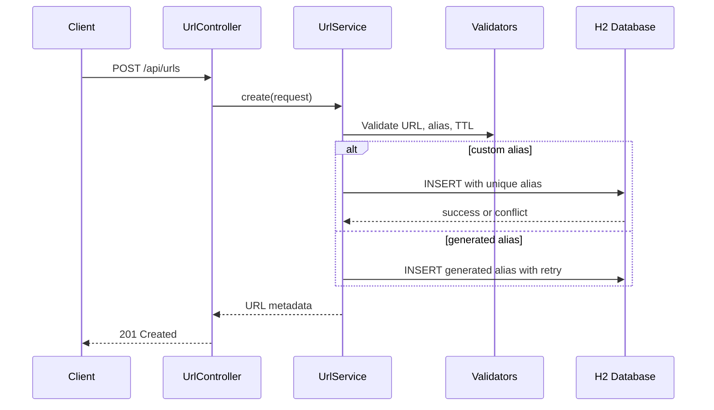
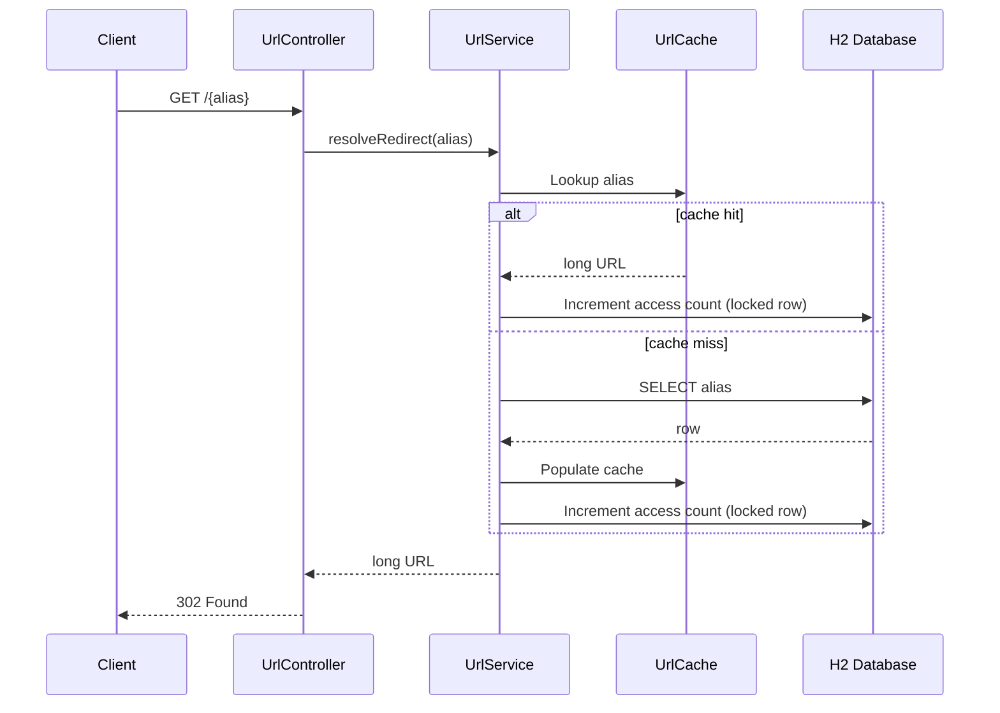

# Architecture

This document describes the request lifecycle and data flow for the URL Shortener REST API (Java / Spring Boot).

## System Overview

```mermaid
flowchart LR
    Client([Client])
    API[Spring MVC Controllers]
    Service[UrlService]
    Cache[(In-Memory LRU Cache)]
    DB[(H2 Database)]

    Client -->|POST /api/urls| API
    Client -->|GET /api/urls/{alias}| API
    Client -->|GET /{alias}| API

    API --> Service
    Service --> Cache
    Service --> DB
    Cache -.->|cache miss| DB
```

## Create URL Flow



## Redirect Flow



## Concurrency and Collision Handling

- Custom aliases use a primary key constraint on `alias`.
- Concurrent requests for the same alias produce one success (`201`) and `409 Conflict` responses for the rest.
- Auto-generated aliases retry up to five times on collision.
- Access count updates use pessimistic row locking via JPA.
- Redirect cache uses a synchronized LRU map for thread-safe reads and writes.

## Components

| Component | Responsibility |
|-----------|----------------|
| `UrlShortenerApplication` | Spring Boot bootstrap |
| `UrlController` | HTTP routing and response mapping |
| `service` | Business logic, caching, expiration checks |
| `repository` | JPA persistence layer |
| `cache` | Hot-path redirect cache |
| `util` | URL validation and alias generation |
| `exception` | Centralized API error handling |
